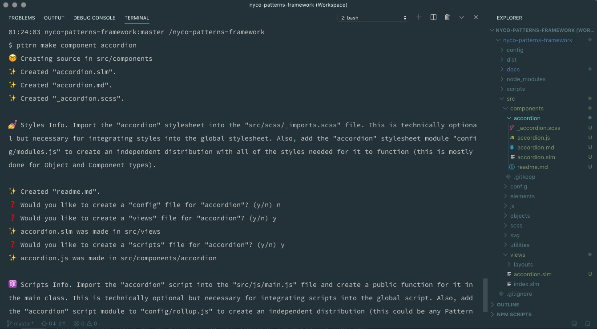
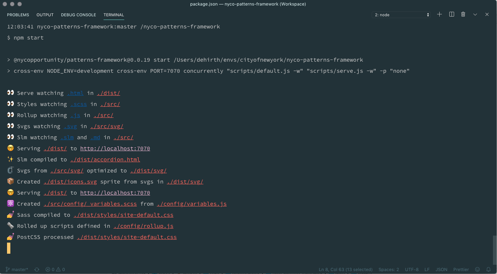

# NYCO Patterns Framework

Front-end stack, CLI, and cross-utility library for design systems. Created by NYC Opportunity for [NYCO Patterns](https://nycopatterns.cityofnewyork.us), [ACCESS NYC Patterns](https://accesspatterns.cityofnewyork.us), and Growing Up/Generation NYC Patterns.

* 📦 Creates and organizes pattern source code using a [design system methodology](#design-system-methodology).
* ⚪ Manages [Design Tokens](#design-tokens) through JavaScript configuration and shares them with Sass files.
* 💅 Compiles [Sass](https://sass-lang.com/) using [node-sass](https://github.com/sass/node-sass) and [PostCSS](https://postcss.org/).
* 🗞 Bundles JavaScript ES using [rollup.js](https://rollupjs.org/guide/en/).
* 🗜️ SVG icon optimizer and sprite generator using [svgo](https://github.com/svg/svgo) and [svgstore-cli](https://github.com/svgstore/svgstore-cli).
* ✨ Generates a static site using [slm-lang](https://github.com/slm-lang) for documentation and development.
* 🤓 Serves the local development environment using [Express.js](https://expressjs.com/).
* 🌈 CSS and JavaScript Framework agnostic; use Bootstrap, Tailwindcss, Svelte, React, or Vue (or none of them... or all of them).
* 🚀 Scripts for publishing a pattern library to [npm](https://www.npmjs.com/) for integration in a digital product ecosystem.

Each major feature uses a [configuration file](https://github.com/CityOfNewYork/nyco-patterns-framework/tree/master/config) for adding additional plugins and functionality. Additionally, this package can be extended with npm packages and custom [npm scripts](https://docs.npmjs.com/misc/scripts).

## Contents

* [Installation](#installation)
* [NPM Scripts](#npm-scripts)
* [CLI](#cli)
  * [Commands](#commands)
  * [Flags](#flags)
  * [NODE_ENV](#node_env)
* [Optional dependencies](#optional-dependencies)
* [Updating](#updating)
* [NVM](#nvm)
* [Design System Methodology](#design-system-methodology)
* [Cross-Utility Library](#cross-utility-library)
* [Documentation](#documentation)

## Usage

    $ npm install @nycopportunity/patterns-framework --save-dev

**$2** Copy the [./config](https://github.com/CityOfNewYork/nyco-patterns-framework/tree/master/config) directory into the root your pattern library.

**$3** If you are using any of the [optional dependencies](#optional-dependencies) used by the scripts in the *./config* directory you will need to install them manually. If you do not want to use them they need to be removed from the config files in the *./config* directory.

**$4** *Recommended*. Add the following npm scripts to your Patterns Library;

    "scripts": {
      "pttrn": "pttrn",
      "start": "cross-env NODE_ENV=development cross-env PORT=7070 concurrently \"pttrn default -w\" \"pttrn serve -w\" -p \"none\"",
      "default": "cross-env NODE_ENV=production pttrn default",
      "version": "npm run default && git add .",
      "prepublishOnly": "git push && git push --tags",
      "publish": "cross-env NODE_ENV=production pttrn publish"
    },

**$5**

Optional. Create an alias for the `pttrn` cli. If this step is not done, the npm script `pttrn` above can be used instead.

    alias pttrn="./node_modules/.bin/pttrn"

**$6** Make a pattern and configure **rollup.js** and **node-sass** to compile it;

    pttrn make component accordion

**$6** Start the development server (assuming you've added the [npm scripts](#npm-scripts) above to your package.json) and writing code;

    npm start

**$7** Version your library (assuming you've added the [npm scripts](#npm-scripts) above to your package.json)...

    npm version {{ major/minor/patch }}

... then publish to **npm** for integration in other projects...

    npm publish

## NPM Scripts

The recommended [npm scripts](https://docs.npmjs.com/misc/scripts) create shortcuts for using the cli.

Command       | Args              | Description
--------------|-------------------|-
`start`       |                   | This starts the [Express.js](https://expressjs.com/) development server, which uses Express to render the views in **dist/**. It also uses [Concurrently](https://www.npmjs.com/package/concurrently) to trigger **--watch** scripts for the [default and serve commands](#commands). The `NODE_ENV` is set to `development` which affects the the styles compilation process by only compiling the global stylesheet.
`run default` |                   | Runs a one-off compilation of all assets to the distribution directory in `production` mode.
`version`     | major/minor/patch | Runs the `default` script and creates a new release using [npm's semantic versioning command](https://docs.npmjs.com/cli/version).
`publish`     |                   | Publish to the npm registry. This will run `prepublishOnly` and `publish` scripts in the recommended [npm scripts](#npm-scripts) above as well which push all tags to GitHub. Publishing requires running the `version` script before publishing.

## CLI

Individal commands can be executed using the `pttrn` command which maps to this package's bin script. Avaliable commands can be seen below.

    pttrn {{ command }}

Each script has corresponding configuration files in the **config/** directory.

### Commands

Command                           | Configuration           | Optional&nbsp;Flags | Description
----------------------------------|-------------------------|---------------------|-
`default`                         |                         | -w -n               | Lints files then asynchronously runs the _scripts_, _styles_, _svg_, and _build_ scripts (detailed below).
`serve`                           |                         | -w -n               | Starts and Express app that serves the static files in the *./dist/* directory. By default it runs on port `7000` but this can be modified by the `PORT` environment variable.
[`make`](./docs/commands/make.md) | *make.js*               |                     | Starts a survey prompt for creating a new pattern using templates defined in the configuration. [Read the `make` command docs](./docs/commands/make.md).
`lint`                            | *package.json*          |                     | Lints JS and Sass files in the *./src/* directory using the `eslintConfig` and `stylelintConfig` objects in the *package.json* file.
`rollup `                         | *rollup.js*             | -w -n               | Runs Rollup.js, compiling pattern scripts defined in the configuration from ES Modules into CommonJS and/or iffe modules.
`styles`                          |                         | -w                  | Syncronously runs the _tokens_, _sass_, and _postcss_ scripts (detailed below).
`tokens`                          | *tokens.js*             | -w -n               | Converts *./config/tokens.js* into *./src/config/_tokens.scss*.
`sass`                            | *sass.js*               |                     | Processes pattern Sass stylesheets defined in the configuration into CSS. If the NODE_ENV is set to "development" only the modules with the attribute `devModule: true` will be compiled.
`postcss`                         | *sass.js*, *postcss.js* |                     | Runs PostCSS on Patterns CSS stylesheets defined in the *./config/sass.js* into CSS. PostCSS plugins are defined in the configuration.
`svgs`                            |                         | -w -n               | Optimizes SVGS in the *./src/svg/* directory into the *./dist/svg* directory and creates an svg sprite for library icons in the *./dist/icons.svg* file.
`slm`                             | *tokens.js*, *slm.js*   | -w                  | Compiles Slm Lang files in *./src/views/* directory into static .html pages in the *./dist* directory.
`locals`                          | *tokens.js*, *slm.js*   |                     | This isn't a CLI script but it exports the local variables for the slm-lang templates.
`publish`                         | *publish.js*            |                     | Publishes the *./dist* directory to the `gh-pages` branch of the repository.

### Flags

Flag | Full&nbsp;Flag | Description
-----|----------------|-
`-w` | `--watch`      | Use [Nodemon](https://www.npmjs.com/package/nodemon) to watch source files and rerun the command when changes are made.
`-n` | `--noisy`      | Some commands use [ShellJS](https://www.npmjs.com/package/shelljs) to execute other command line tasks. By default, their native output is silenced by configuring ShellJS to execute commands silently. This will allow those commands to show their native output.

### NODE_ENV

Some scripts, particularly `sass`, `rollup`, and `publish` require setting the `NODE_ENV` version to `production` or `development` in order to run. Patterns should be compiled in the production environment before publishing. The `npm publish` script will do this automatically.

    NODE_ENV=production pttrn rollup

## Optional dependencies

The following dependencies are optional as they are used by configuration files. If your pattern library uses them they will need to be added manually.

    @rollup/plugin-buble
    @rollup/plugin-commonjs
    @rollup/plugin-node-resolve
    @rollup/plugin-replace
    autoprefixer
    chalk
    css-mqpacker
    cssnano
    eslint-config-google
    node-emoji
    rollup-plugin-babel
    stylelint-config-standard
    tailwindcss

However, if you do not want to include them you will need to update the config files for PostCSS (config/postcss.js), Rollup.js (config/rollup.js), and alerts (config/alerts.js) by removing the required/imported dependencies and instances of their use in the file.

## Updating

It's easiest to specify a version of the framework to update to as well as link the updated version.

    npm install @nycopportunity/patterns-framework@{{ version }}

    npm link @nycopportunity/patterns-framework@{{ version }}

## NVM

If you are using `nvm` to manage versions of node, be sure you are using the correct version of node in your project directory. `npm link` creates a symlink to *node_modules/@nycopportunity/patterns-framework* in the current environment's node folder. Therefore, the CLI will reference the linked package in the environment's version of node.

## Design System Methodology

All of your project's source code will be organized into four directories: **Elements**, **Components**, **Objects**, and **Utilities**. Read about this system in the [documentation](./docs/patterns.md). The [`make` command](./docs/commands/make.md) automatically takes care of the organization for you, creating the necessary files based on templates in the [`make` config](./config/make.js).

    src/elements/pattern
    src/components/pattern
    src/objects/pattern
    src/utilities/pattern

Each Pattern directory will contain all of the files needed for it's

    src/component/pattern/pattern.slm   // Markup
    src/component/pattern/pattern.js    // JavaScript
    src/component/pattern/_pattern.scss // Styling
    src/component/pattern/pattern.md    // Documentation
    src/component/pattern/readme.md     // Developer Usage

### Utilities

Utilities are reusable single-attribute styles used to customize markup. They are not tied to any element, component, or object, but they can override properties in certain contexts and help build views more efficiently by having to write less CSS. The Pattern Framework can rely on [Tailwindcss](https://tailwindcss.com/) for most stylistic utilities, although, it is an optional dependency.

### Design Tokens

Design Tokens are named variables that store visual properties. They are shared between JavaScript and Sass files using the `tokens` command which converts stored tokens in *./config/tokens.js* into *./src/config/_tokens.scss*. They can also be passed to the [Tailwindcss Configuration](https://tailwindcss.com/docs/configuration) for customization of CSS utilities.

## Cross-Utility Library

The pattern framework ships with shared ES Utility Modules (and some Sass) for front-end development which includes helpers for Form Validation, Toggling Elements, etc. Browse the current set in the [documentation](./docs/readme.md).

## Documentation

Additional [documentation can be found here](./docs/readme.md).

---

[The Mayor's Office for Economic Opportunity](http://nyc.gov/opportunity) (NYC Opportunity) is committed to sharing open source software that we use in our products. Feel free to ask questions and share feedback. **Interested in contributing?** See our open positions on [buildwithnyc.github.io](http://buildwithnyc.github.io/). Follow our team on [Github](https://github.com/orgs/CityOfNewYork/teams/nycopportunity) (if you are part of the [@cityofnewyork](https://github.com/CityOfNewYork/) organization) or [browse our work on Github](https://github.com/search?q=nycopportunity).